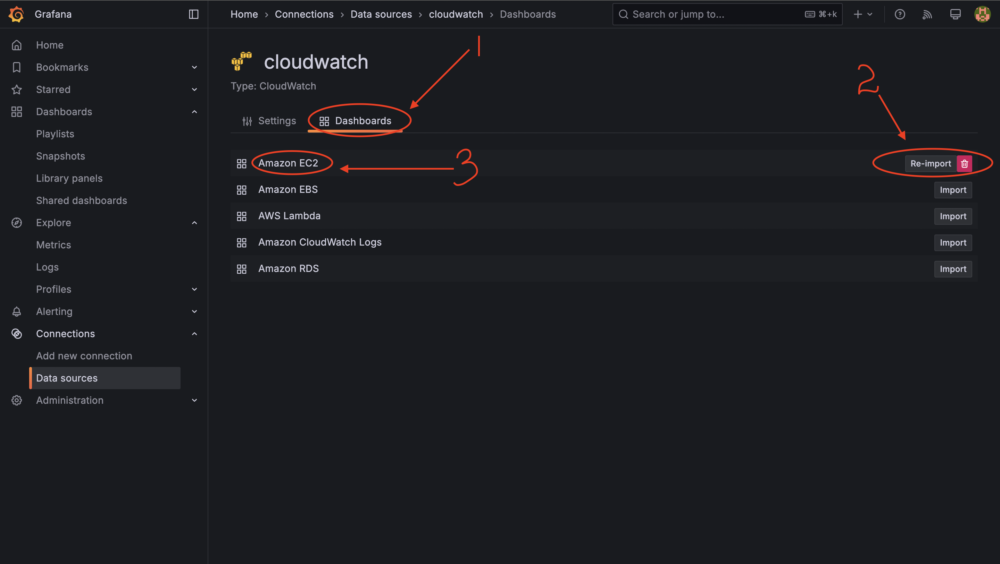

# AWS Essentials: Use IAM Roles

What is Grafana's use if you are not connecting it to any data sources? In this task, we will connect your deployment to CloudWatch using the IAM role so you can visualize metrics from your AWS account in Grafana. 

## Prerequirements

Before completing any task in the module, make sure that you followed all the steps described in the **Environment Setup** topic, in particular: 

1. Make sure you have an [AWS](https://aws.amazon.com/free/) account.

2. Install [AWS CLI](https://docs.aws.amazon.com/cli/latest/userguide/getting-started-install.html).

3. Install [PowerShell Core](https://learn.microsoft.com/en-us/powershell/scripting/install/installing-powershell?view=powershell-7.4).

4. Install [Terraform](https://developer.hashicorp.com/terraform/tutorials/aws-get-started/install-cli).

5. Log in to AWS CLI on your computer by running the command:
   
    ```
    aws configure
    ```

## Task Requirements 

In this task, you will deploy a new EC2 instance with Grafana and connect Grafana to your AWS account using the IAM role. 

To complete this task: 

1. To make sure that you are not running out of free limits in your AWS account, make sure to clean up the resources you deployed in the [previous task](https://github.com/mate-academy/aws_devops_task_4_deploy_virtual_machine). For that, navigate to the folder with task files on your computer, and run command:
   
```
    terraform destroy
```

2. Edit `terraform.tfvars` - fill out the `tfvars` file with the previous modules' outputs and your configuration variables. You should use those variables as parameters for the resources in this task. This task requires only two variables - `subnet_id` and `security_group_id`. You can get it as terraform module output in the [previous task](https://github.com/mate-academy/aws_devops_task_3_configure_network). 

3. Edit `main.tf` — add resources, required for this task: 
    
    - use [`aws_iam_policy`](https://registry.terraform.io/providers/hashicorp/aws/latest/docs/resources/iam_policy) resource to create a policy with permissions, necessary for Grafana to read metrics and logs from CloudWatch. You can find JSON definition of such policy in file `grafana-policy.json` in this repository.

    - use [`aws_iam_role`](https://registry.terraform.io/providers/hashicorp/aws/latest/docs/resources/iam_role) resource to create the IAM role for your Grafana instance. You can find the assume role policy definition in the file `grafana-role-asume-policy.json` in this repository. 

    - use [`aws_iam_role_policy_attachment`](https://registry.terraform.io/providers/hashicorp/aws/latest/docs/resources/iam_role_policy_attachment) resource to attach policy you created to the role you created. 

    - use [`aws_iam_instance_profile`](https://registry.terraform.io/providers/hashicorp/aws/latest/docs/resources/iam_instance_profile) resource to create an instance profile. The instance profile object is not visible when doing some operations in AWS Console: it is created automatically there, but you need to create it manually when assigning a role to an EC2 instance with Terraform or AWS CLI. 

    Update the existing resource, `aws_instance,` and add an instance profile to assign the IAM role to the instance. 

4. Run the following commands to generate a Terraform execution plan in **JSON** format: 

    ```
    terraform init
    terraform plan -out=tfplan
    terraform show -json tfplan > tfplan.json
    ```

5. Run an automated test to check yourself:
 
    ```
    pwsh ./tests/test-tf-plan.ps1
    ```

If any test fails, please check your task code and repeat step 4 to generate a new tfplan.json file. 

6. Deploy infrastructure using the following command: 
    
    ```
    terraform apply
    ```
    Make sure to collect module outputs - we will use those values in the next tasks. 

7. Wait 5 minutes after the deployment and try to open that Grafana URL from the Terraform module output. When logging in for the first time, you will be prompted to change the admin password. Save the new password somewhere — you will need it for the next task. 

8. In your Grafana deployment, add a new data source with the type 'CloudWatch'. The only data source parameter you need to set is the default region — use the one you have your instance deployed to. Save changes, test the connection, and be impressed😎 Your Grafana instance connected to your AWS account without you specifying any credentials at all, yet in a very secure manner.  

9. In your CloudWatch datasource page, switch to tab **Dashboards**, import **Amazon EC2** dashboard, and click on it — you should see a dashboard populated with monitoring data. Make a screenshot of the dashboard, and attach it to the repo.


10. Commit file `tfplan.json` and the screenshot of the EC2 dashboard, and submit your solution for review. 
